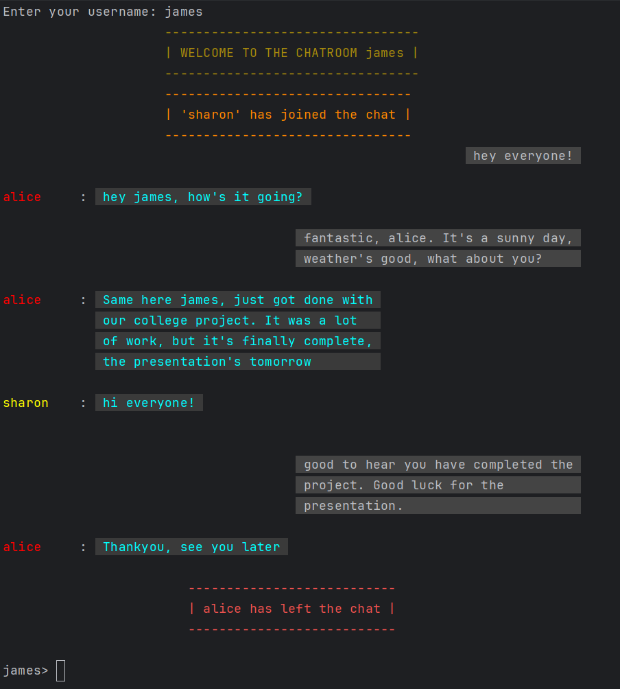
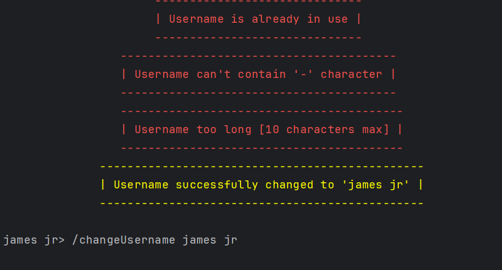
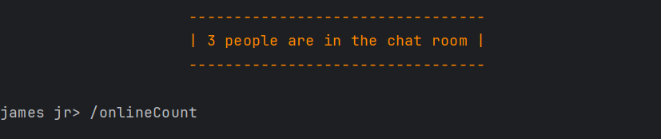
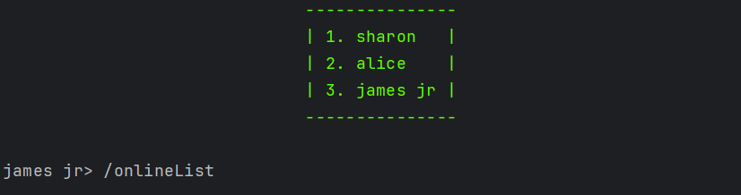
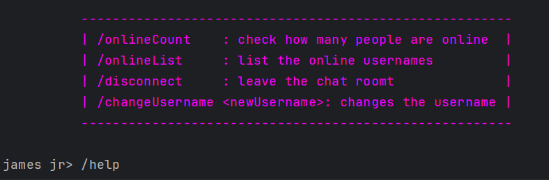
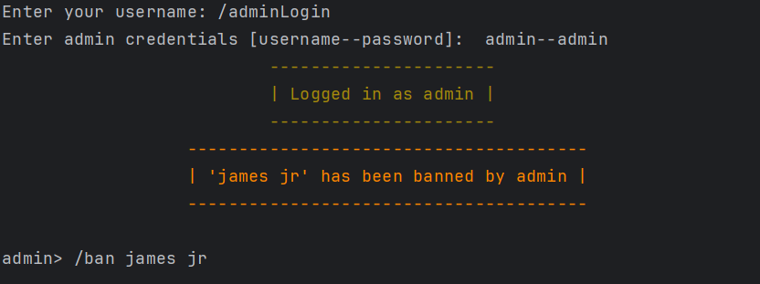
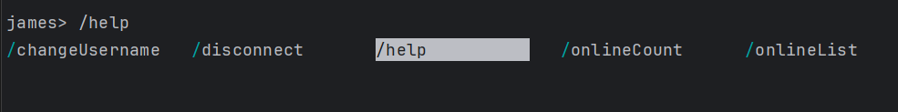

# Chat Room

**A terminal-based chat application built using java.net.Socket. Work in progress(eg: chat persistence)**

## 1. multiple users can join and leave

## 2. username can be changed if valid

## 3. users can query online count, online users list, and help

## 4. login as admin and use /ban

> NOTE: clients can only enter '/' and then `<TAB>` to look through the list of commands.

